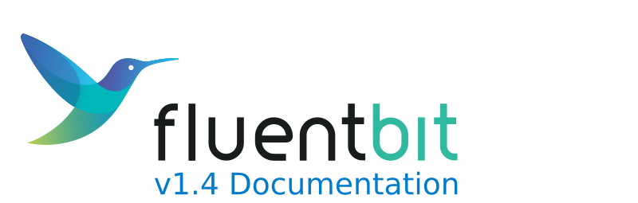

# Introduction

[Fluent Bit](http://fluentbit.io) is a Fast and Lightweight Log Processor, Stream Processor and Forwarder for Linux, OSX, Windows and BSD family operating systems. It has been made with a strong focus on performance to allow the collection of events from different sources without complexity.

### Features

* High Performance
* Data Parsing
  * Convert your unstructured messages using our parsers: [JSON](https://docs.fluentbit.io/manual/parser/json), [Regex](https://docs.fluentbit.io/manual/parser/regular_expression), [LTSV](https://docs.fluentbit.io/manual/parser/ltsv) and [Logfmt](https://docs.fluentbit.io/manual/parser/logfmt)
* Reliability and Data Integrity
  * [Backpressure](https://docs.fluentbit.io/manual/configuration/backpressure) Handling
  * [Data Buffering](https://docs.fluentbit.io/manual/configuration/buffering) in memory and file system
* Networking
  * Security: built-in TLS/SSL support
  * Asynchronous I/O
* Pluggable Architecture and [Extensibility](https://docs.fluentbit.io/manual/development): Inputs, Filters and Outputs
  * More than 50 built-in plugins available
  * Extensibility
    * Write any input, filter or output plugin in C language
    * Bonus: write [Filters in Lua](https://docs.fluentbit.io/manual/filter/lua) or [Output plugins in Golang](https://docs.fluentbit.io/manual/development/golang_plugins)
* [Monitoring](https://docs.fluentbit.io/manual/configuration/monitoring): expose internal metrics over HTTP in JSON and [Prometheus](https://prometheus.io/) format
* [Stream Processing](https://docs.fluentbit.io/stream-processing/): Perform data selection and transformation using simple SQL queries
  * Create new streams of data using query results
  * Aggregation Windows
  * Data analysis and prediction: Timeseries forecasting
* Portable: runs on Linux, MacOS, Windows and BSD systems

### Fluentd and CNCF

[Fluent Bit](http://fluentbit.io) is part of the [Fluentd](http://fluentd.org) project ecosystem, it's licensed under the terms of the [Apache License v2.0](http://www.apache.org/licenses/LICENSE-2.0). This project is made and sponsored by [Treasure Data](https://www.treasuredata.com).

